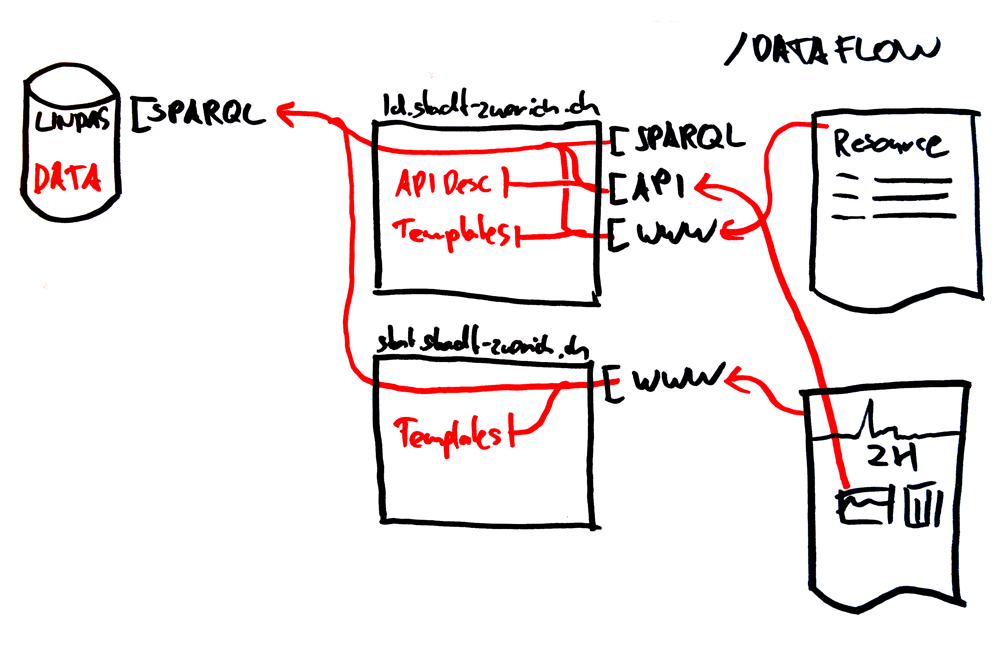
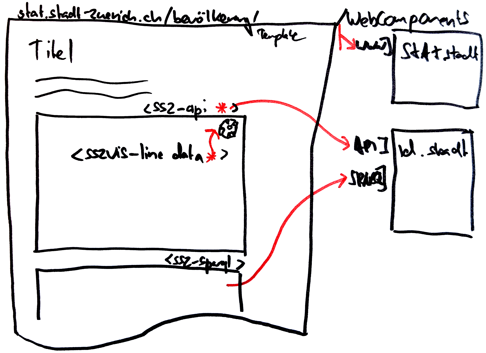

## Proof-of-Concept

Intro RDF (lightning talk)?

### Backend

- [Pipelines (HDB to RDF)](https://github.com/zazuko/statistik-zuerich/tree/csvw-js)

- lindas-data.ch (SPARQL store)
  - [SPARQL](https://lindas-data.ch/sparql)

- ld.stadt-zuerich.ch (Zazuko Trifid) 
  - [Deref](http://ld.stadt-zuerich.ch/statistics/code/R00091) / [SPARQL Abfragen](http://ld.stadt-zuerich.ch/sparql/)
  - [API (Zazuko Trifid)](http://ld.stadt-zuerich.ch/api) -> beschrieben als RDF 

### Frontend
stat.stadt-zuerich.ch

  - PoC
    - [d3-sparql Visual Primitives Widget](https://zazuko.github.io/ssz-webcomp-test/)
    - [WebData Widget](http://localhost:9966/index-widget.dev.html)

  - Templates (gesteuert durch Beschreibung) -> Routing, HTML
  - WebComponents (für interaktive Elemente) -> WebComponents

## Phase2
### Dataflow

### Website

- Pipelines Fertigstellung / Validations Checks
- API Komponente Fertigstellung

- stat.stadt-zuerich.ch (Zazuko Trifid)
  - RDF (schema.org) Website
  - WebComponents
  - Datadriven Templates

- WebComponents (zwei Layers)
  - WebComponents Visual Primitives
    - D3 Widgets Modularisierung
      - `<sszvis-line data=“”>`
    - Parametrisierbar
      - `<sszvis-line title=“” ..>`
  - WebComponents DataConnector
    - API Introspection
    - STIP Elemente (komplexere Elemente)
    - SPARQL Visual Primitives Widget

- Datadriven Templates

- Monitoring
- HA Betreibung Platform / Testumgebung für weitere Entwicklungen
